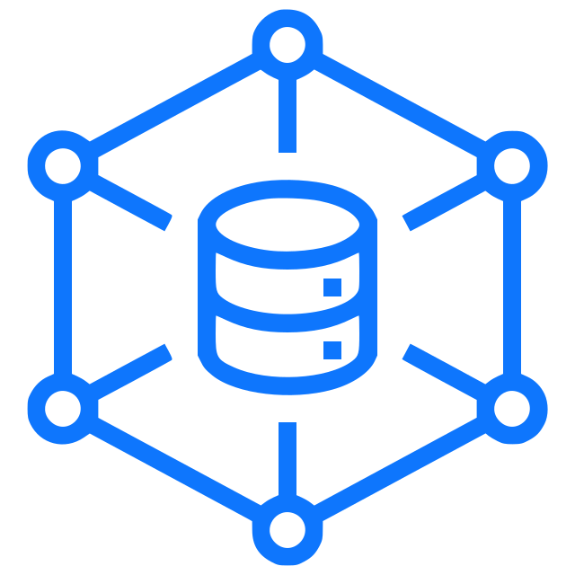

  

<h3 align="center">dArchive</h3> 

<a href="https://darchive.vercel.app/">Demo Link</a>

---

 Decentralized Archive (dArchive) is a decentralized application to create an archive of web pages that can always be accessed online even if the original page disappears.
      

## 📝 Table of Contents

- [About](#about)
- [Usage](#usage)
- [Built Using](#built_using)
- [Authors](#authors)
- [Thanks](#thanks)

## 🧐 About 

dArchive is a decentralized archiving application that lets you snapshot any webpage anytime to create a digital archive so you can access it forever. It uses different web3 technologies to provide the decentralized version of the archiving application called archive.today

It allows a user to save a webpage HTML, screenshot, and metadata to the decentralized storage providers like IPFS and Filecoin, and the content identifier of the folder, title, and URL is emitted as an event and indexed using the graph which is used for querying and filtering. The user can search the stored webpages based on different filters and can view and download the saved webpages and screenshots. This can be useful if you want to take a 'snapshot' of a page that could change soon: price list, job offer, real estate listing, drunk blog post, etc. Users can support the project by donating to the project using polygon MATIC which can be used for paying for storage, hosting, indexing, and meta transactions to let other users save their webpages without paying fees.

## 🎈 Usage 

1. Archive: User connects a wallet to the dApp then visit the archive page and enter a URL to archive. Then, the html and screenshot of the webpage is saved and uploaded via web3.storage and the content identifier, title and URL is passed to the smart contract function and emitted as an event and the events are indexed by the graph to create an api to query the saved webpages.

2. Search: User can query with filters and get the results and visit the results page to view the saved webpage and screenshot and also can download the webpage html and screenshot.

3. Support: User can support the project and also receive a SoulBound NFT if he/she is supporting the first time.

4. FAQs: User can visit the FAQ page for Frequently Asked Questions and answers.

5. About: User can visit the About page to know more about the team members, project repository and technologies powering the project.

## ⛏️ Built Using 

- [Web3.storage](https://web3.storage/) - Decentralized Data Storage
- [Polygon](https://polygon.technology) - Blockchain
- [Spheron](https://spheron.network/) - Deploy Your Full Stack App to the Decentralized cloud
- [Solidity](https://docs.soliditylang.org/) -  Smart Contract Programming
- [Hardhat](https://hardhat.org/) - Ethereum Development Environment
- [RainbowKit](https://www.rainbowkit.com/) - The best way to connect a wallet
- [Nextjs](https://nextjs.org/) - Reactjs Web Development Framework
- [Chakra UI](https://chakra-ui.com/) - A simple, modular and accessible component library.
- [single-file-cli](https://github.com/gildas-lormeau/single-file-cli) - Single HTML File Saver

## ✍️ Authors 

- [@pawanpaudel93](https://github.com/pawanpaudel93)

See also the list of [contributors](https://github.com/pawanpaudel93/dArchive/contributors) who participated in this project.

## 🎉 Thanks 
- [archive.today](https://archive.today)